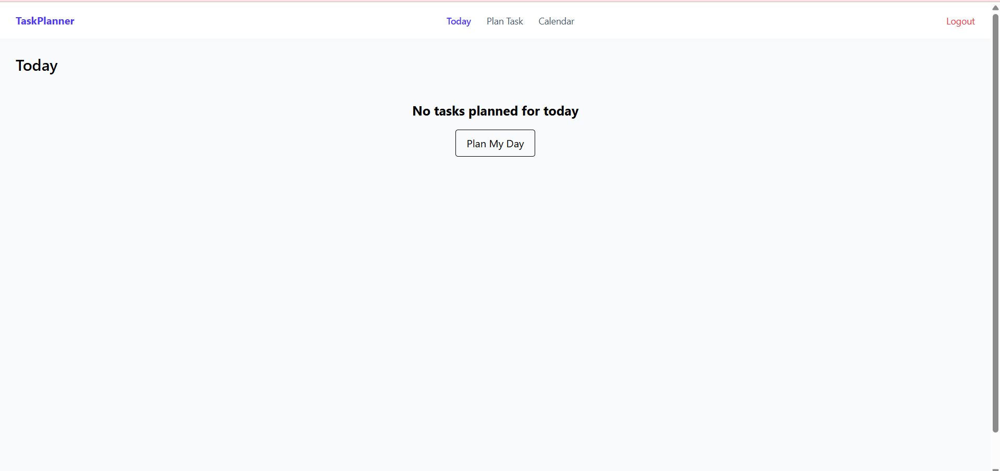
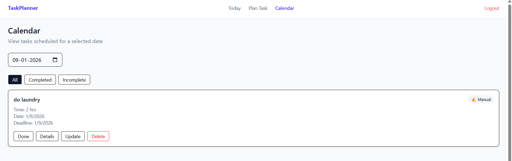

# Multi-Client Service Platform (Task Management System)

## 📌 Project Overview
This project is a Multi-Client Service Platform implemented as a Task Management System. The platform allows multiple users (clients) to register, log in, and manage their tasks efficiently.

Each user acts as an independent client interacting with the system, demonstrating a multi-client architecture.

---

## 🚀 Features
- User Registration & Login (Authentication)
- Multi-User Support (Multi-Client System)
- Create, Update, Delete Tasks (Service Management)
- User-specific dashboards
- Secure data handling

---

## 🧠 Concept Mapping

| Internship Requirement | Project Implementation |
|----------------------|----------------------|
| Multi-Client System | Multiple users login |
| Services | Tasks |
| Dashboard | Task dashboard |
| User Interaction | CRUD operations |

---

## 🛠 Tech Stack
- Frontend: React.js
- Backend: Node.js, Express.js
- Database: MongoDB

---

## 📚 Learning Outcome
This project demonstrates understanding of:
- Full Stack Development
- Client-Server Architecture
- REST APIs
- Authentication & Authorization
- Object-Oriented Design Principles

---

## 📸 Screenshots

### Today Dashboard

### Task Planning

### Calendar View

---

## 🔗 GitHub Repository
https://github.com/Mahumood-Sameema/multi-client-service-platform
